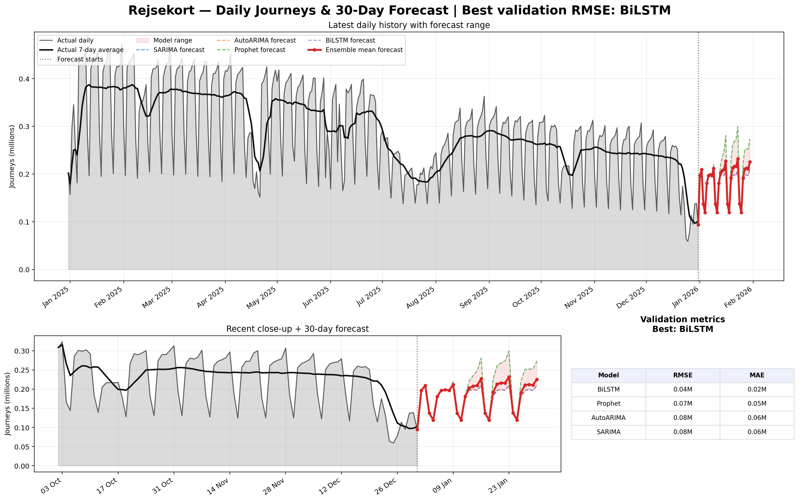
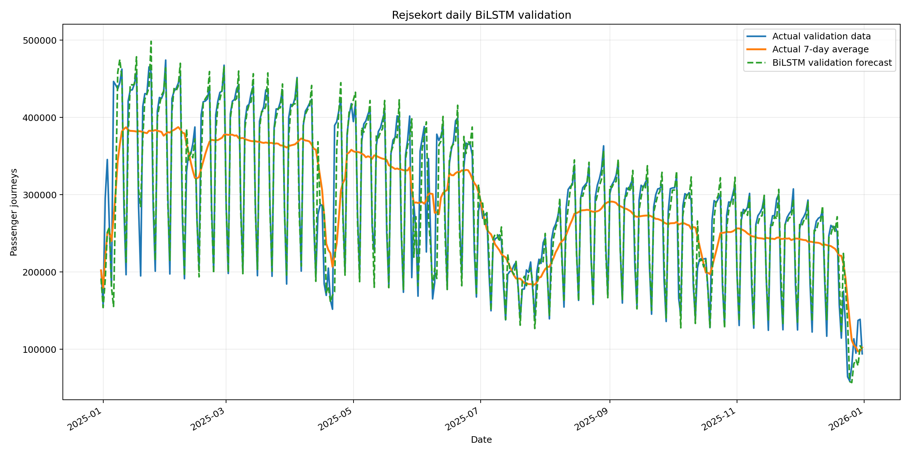
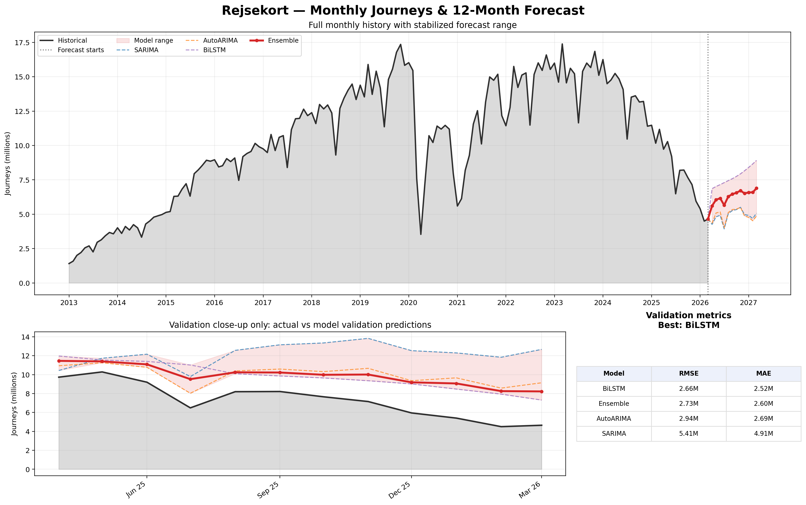

# Predicting Rejsekort Journeys

This repository automatically downloads Rejsekort passenger journey data from passagertal.dk and runs daily and monthly forecasting pipelines.


```bash
node pipeline/download-daily.js && python pipeline/prepare_daily_ingest.py
```

The JavaScript download scripts remain the ingestion layer. They are kept in headless mode, and the Python pipeline is built around the Excel files they download.

The details for feature engineering for the statistical models can be found in the paper [here](https://github.com/sm-ak-r33/Predicting-Rejsekort-Price-Increase-2023/blob/main/rejsekort.pdf)  

Daily preprocessing rejects non-daily hierarchy rows from the Excel export. The downloaded crosstab can contain rows like year totals and month totals in the same date hierarchy. Pandas/dateutil can accidentally interpret a value like `2024` as `2024-01-01`, which creates artificial January spikes. The cleaner now only accepts true day-level dates and drops aggregate spikes before modelling.

The SARIMA and AutoARIMA daily models are fitted on a `log1p` transformed series and converted back with `expm1`. Their outputs also use a conservative day-of-week historical floor. This prevents ARIMA-family models from turning negative forecasts into impossible zero-passenger days while still preserving weekend/weekday seasonality.

All generated results are grouped under `results/` instead of being scattered in the repository root.

## Result plots

After `python -m dvc repro --force` runs, the latest output plots are written to these paths. GitHub will render these images in this README once the workflow has generated and committed them.

| Plot | Path |
|---|---|
| Daily trend and 30-day forecast | `results/daily/daily_trends.png` |
| Daily BiLSTM(Best Model) validation | `results/daily/bilstm_validation.png` |
| Monthly trend and 12-month forecast | `results/monthly/monthly_trends.png` |

## Output plots

### Daily forecast trend


### Daily BiLSTM(Best Model) validation zoomed-in


### Monthly forecast trend



Here Ensemble is a simple average of the top 2 best-performing models from validation.

## Result folders

```text
results/
  daily/
    data_cleaned.csv
    sarima_metrics.csv
    sarima_forecast.csv
    autoarima_metrics.csv
    autoarima_forecast.csv
    prophet_metrics.csv
    prophet_forecast.csv
    bilstm_metrics.csv
    bilstm_forecast.csv
    bilstm_validation.png
    daily_forecast.csv
    daily_model_metrics.csv
    daily_trends.png
  monthly/
    monthly_cleaned.csv
    monthly_forecast.csv
    monthly_model_metrics.csv
    monthly_trends.png
```

Raw downloaded Excel files remain where the Playwright scripts write them:

```text
Data(update).xlsx
pipeline/rejsekort_latest_year_daily_export.xlsx
pipeline/rejsekort_monthly_chart_export.xlsx
pipeline/rejsekort_monthly_export_extension_data.xlsx
```

## Daily pipeline

The daily flow is:

1. `download-daily.js` downloads the latest-year daily Excel export.
2. `prepare_daily_ingest.py` validates the Excel file and copies it to `Data(update).xlsx`.
3. `preprocessing.py` cleans the daily data and writes `results/daily/data_cleaned.csv`.
4. The daily algorithms run:
   - SARIMA
   - AutoARIMA
   - Prophet
   - BiLSTM
5. `daily_forecast.py` combines daily forecasts and writes:
   - `results/daily/daily_forecast.csv`
   - `results/daily/daily_model_metrics.csv`
   - `results/daily/daily_trends.png`

The daily trend image shows the latest year of actual daily observations, a 7-day rolling average, all model forecasts, and the ensemble mean forecast.

## Monthly pipeline

The monthly stage runs both monthly download scripts:

```bash
node pipeline/download-monthly.js
node "pipeline/download-mothly-script 2.js"
```

Then `monthly_forecast.py` cleans the structurally different monthly Excel exports, combines them, runs the available forecasting algorithms, and writes all monthly outputs to `results/monthly/`.

The monthly trend image is written to:

```text
results/monthly/monthly_trends.png
```

## Setup

### Python

This repo is compatible with Python 3.8-style typing. Python 3.9-only annotations such as `dict[str, ...]` are not used.

```bash
python -m venv .venv
source .venv/bin/activate  # Windows: .venv\Scripts\activate
pip install -r requirements.txt
```

### Node / Playwright

```bash
npm install
npx playwright install chromium --with-deps
```

On Windows, use:

```bash
npx playwright install chromium
```

## Run the full pipeline

```bash
python -m dvc repro --force
```

## Useful DVC commands

Run only the daily ingest:

```bash
python -m dvc repro ingest --force
```

Run preprocessing after ingest:

```bash
python -m dvc repro preprocess --force
```

Run only the final daily plot/combined forecast after the models finish:

```bash
python -m dvc repro daily_forecast --force
```

Run only the monthly pipeline:

```bash
python -m dvc repro monthly --force
```

```bash
git add dvc.lock docs/assets/daily_trends.png docs/assets/bilstm_validation.png docs/assets/monthly_trends.png README.md
```


## GitHub Actions schedule

The workflow is monthly. It runs on the first day of each month at 04:00 UTC:

```yaml
schedule:
  - cron: "0 4 1 * *"
```

Also can start manually from the GitHub Actions tab with `workflow_dispatch`.

## DVC stages

| Stage | Command | Main output |
|---|---|---|
| `ingest` | `node pipeline/download-daily.js && python pipeline/prepare_daily_ingest.py` | `Data(update).xlsx` |
| `preprocess` | `python pipeline/preprocessing.py` | `results/daily/data_cleaned.csv` |
| `selected_arima` | `python pipeline/selected_arima.py` | `results/daily/sarima_metrics.csv`, `results/daily/sarima_forecast.csv` |
| `autoarima` | `python pipeline/autoarima.py` | `results/daily/autoarima_metrics.csv`, `results/daily/autoarima_forecast.csv` |
| `prophet` | `python pipeline/prophet_model.py` | `results/daily/prophet_metrics.csv`, `results/daily/prophet_forecast.csv` |
| `bilstm` | `python pipeline/BiLSTM.py` | `results/daily/bilstm_metrics.csv`, `results/daily/bilstm_forecast.csv`, `results/daily/bilstm_validation.png` |
| `daily_forecast` | `python pipeline/daily_forecast.py` | `results/daily/daily_forecast.csv`, `results/daily/daily_model_metrics.csv`, `results/daily/daily_trends.png` |
| `monthly` | monthly JS downloads + `python pipeline/monthly_forecast.py` | `results/monthly/monthly_forecast.csv`, `results/monthly/monthly_model_metrics.csv`, `results/monthly/monthly_trends.png` |

## Notes

The two monthly JavaScript downloads can produce different Excel structures. `monthly_forecast.py` reads candidate sheets/header rows, identifies the best month and passenger columns, normalizes Danish month labels, removes duplicates by month, and then forecasts from the combined monthly series.
